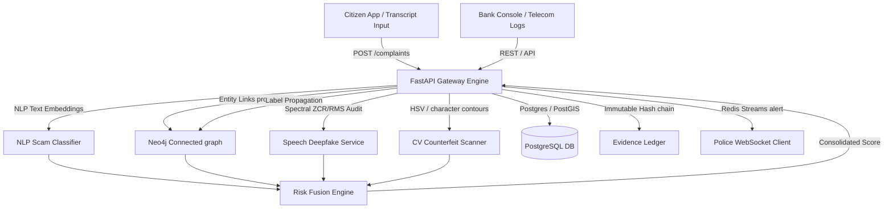

# RakshaNet

Unified Digital Public Safety Intelligence Platform for scam compound fingerprinting, PostGIS geospatial tracking, vision-based counterfeit note auditing, voice deepfake scoring, and cryptographic chain-of-custody case management.

---

## Key System Architecture



---

## Features

- **Multi-Agent Risk Fusion Engine**: Integrates results from NLP text embedding classifiers, graph connection weights, speech deepfake spectral audits, and HSV counterfeit note vision checks into a dynamic, weighted threat index.
- **Scam Compound Fingerprinting**: Group-clustering (Label Propagation) in Neo4j identifies coordinate-independent crime ring campaigns in real time when entities (phones, accounts, spoofed scripts) are shared.
- **PostGIS Geospatial Grid Routing**: Computes crime grid cell densities (`ST_SnapToGrid`) dynamically and assigns case files to nearby active police jurisdictions.
- **Cryptographic Custody Ledger**: Chains SHA-256 block hashes sequentially for every added evidence file, verifying hash chain validity to prevent administrative tampering, and exporting verified dossiers to ReportLab PDFs.
- **Dynamic WebSocket Command Feeds**: Distributes live security events to role-scoped consoles (Citizen, Police, Bank, Telecom, Admin) via a Redis Streams message bus.

---

## Container Architecture

Everything runs locally via a single command:
- **FastAPI Gateway Application**: Ingestion routers, orchestrator, and AI models dashboard (`port 8000`).
- **React Frontend Console**: A Vite + TypeScript + Tailwind single-page app displaying Citizen, Police, Bank, Telecom, and Admin portals (`port 5173`).
- **PostgreSQL / PostGIS**: Dynamic coordinates mapping, cases tables, and metrics stores (`port 55432`).
- **Neo4j Graph Database**: Store entity link connections and execute community calculations (`port 7474 / 7687`).
- **Redis Server**: High-throughput message bus and active alert streaming (`port 6379`).

---

## Getting Started

### Quick Start (Docker)

To spin up the entire unified system, verify dependencies, and launch all servers:
```bash
docker compose up -d --build
```
Verify health:
```bash
python scripts/healthcheck.py
```

### Accessing the Interfaces
- **Frontend Portal**: Navigate to [http://localhost:5173/](http://localhost:5173/) on your browser.
  Use the dropdown in the header to switch roles seamlessly.
- **FastAPI Docs**: Access the interactive API docs at [http://localhost:8000/docs](http://localhost:8000/docs).
- **Neo4j Console**: Browse the live graph database interface at [http://localhost:7474/](http://localhost:7474/).

---

## Executing Automated Tests

### Host-Level Backend Tests (Pytest)
Run the 13 automated tests locally against active container databases:
```bash
cd backend
..\.venv\Scripts\python -m pytest tests/
```

### Frontend Component Tests (Vitest)
Run the automated React component rendering test suite:
```bash
cd frontend
npm run test
```

### End-to-End Simulation Script
Verify the complete 7-step demo flow (Gateway, NLP classification, PostGIS case routing, Neo4j clustering, Bank score propagation, PDF compile, and CV banknote scanning):
```bash
.venv\Scripts\python scripts\e2e_demo_flow.py
```
Output:
```text
=== Starting RakshaNet End-to-End Smoke Test ===
[PASS] Gateway Health Check 
[PASS] Citizen Login 
[PASS] Submit Transcript (Comp ID: 9, Risk Score: 74.0%)
[PASS] Verify Risk Check Explanation
[PASS] Auto Case Linking (Case ID: 1, Title: Campaign Alert: Phone 9988776655, Severity: Medium)
[PASS] PostGIS Heatmap Grid Aggregation (Found 2 grid points)
[PASS] Neo4j Campaign Clustering (Entity '9988776655' mapped to Cluster ID: 0)
[PASS] Bank Risk Assessment (TX ID: 12345, Risk Score: 74.0%)
[PASS] Crypto Hash Chain Verification (Hash: 51c529c1..., Prev: 0000000...)
[PASS] PDF Dossier Compile & Export (Downloaded 2430 bytes PDF)
[PASS] Counterfeit Scan Ingestion (Verdict: Counterfeit, Confidence: 35.0%)
[PASS] Admin Model Metrics Fetch (Retrieved 4 model scores)
```
